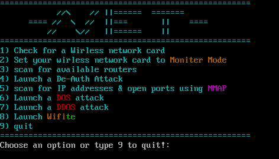

<!-- Badges -->
 <!-- Kali bagdge-->  <!-- Linux bagdge--> <!-- Ubuntu Badge--> 


<!-- Begin the file -->

# **NET**


NET is a tool that automates various options for network scanning and attacking, specifically for wireless networks



### You can also type " c " to clear the terminal


# **installation**
```terminal

git clone https://github.com/Mooshaah/net-tool.git

cd net-tool
chmod u+x net
./net
```
###	 hint : you need to cd into the program directory and type " ./net " every time you want to run the program
